# Parte 1 — Entornos de trabajo

En esta primera parte de la práctica, he preparado y configurado tres entornos de desarrollo completamente independientes para trabajar con Scala 2.12.21. El objetivo ha sido probar diferentes aproximaciones a la hora de escribir y ejecutar código, desde un entorno más interactivo (como Jupyter) hasta IDEs completos preparados para proyectos grandes (como VS Code o IntelliJ). A continuación, detallo los pasos que he seguido en cada uno de ellos.

---

## 1.1 Entorno 1 — JupyterLab + Almond Kernel + Scala 2.12.21

Este primer entorno está pensado para la experimentación interactiva. Gracias a JupyterLab y el kernel de Almond, puedo ejecutar fragmentos de código y ver el resultado inmediatamente, lo que resulta muy cómodo para aprender la sintaxis básica.

### Instalación de JupyterLab
Para instalar JupyterLab, he optado por utilizar el gestor de paquetes de Python, `pip`, ejecutando el comando `pip install jupyterlab`. Considero que es una de las vías más directas y estandarizadas. 

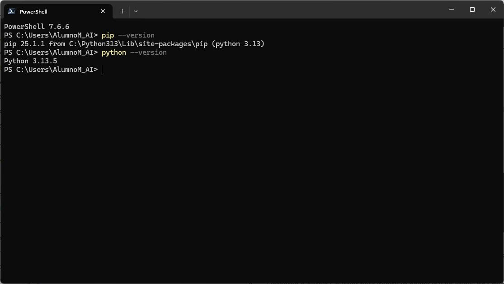

Una vez completada la instalación, he podido arrancar el servidor local ejecutando el comando `jupyter lab` en la terminal. A continuación, el entorno se inicializó y la interfaz de usuario se abrió correctamente en mi navegador web habitual, dejándolo listo para su uso.

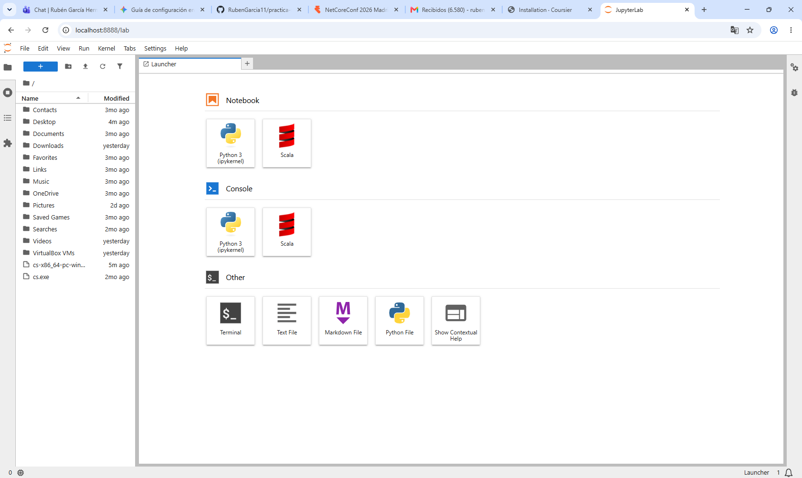

### Instalación de Almond Kernel
Como Jupyter por defecto no soporta Scala de manera nativa, he tenido que instalar el kernel Almond. Para ello, he utilizado `cs` (Coursier), el gestor de dependencias y artefactos de Scala. Siguiendo la documentación oficial, ejecuté el comando de instalación de Almond especificando la versión de Scala requerida:

```bash
cs launch --fork almond --scala 2.12.21 -- --install
```

Este proceso descargó las dependencias necesarias y registró automáticamente el kernel en Jupyter. Tras reiniciar JupyterLab, el kernel de Scala ya aparecía como opción disponible al crear un nuevo Notebook.

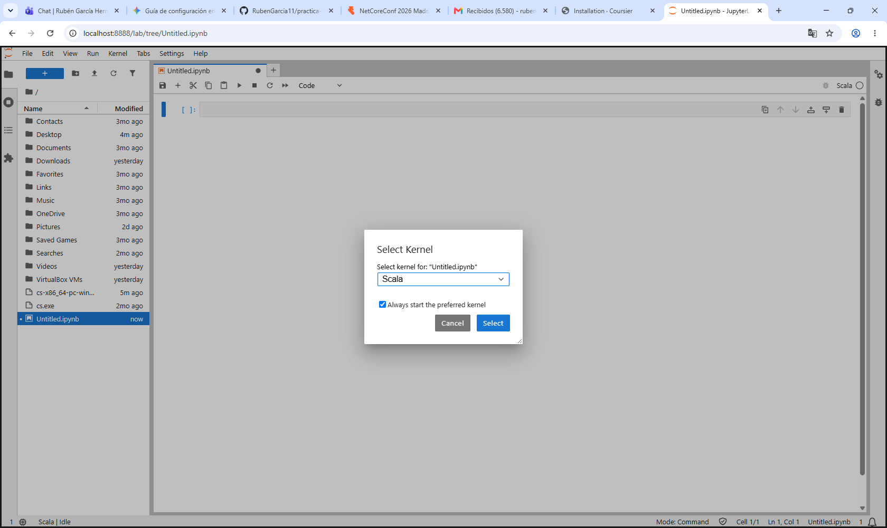

### Verificación de versión y Ejecución de código
Para comprobar que todo funcionaba correctamente, creé un nuevo Notebook seleccionando el kernel de Almond. Lo primero que hice fue verificar la versión del lenguaje ejecutando `util.Properties.versionString`, lo que me permitió confirmar que efectivamente estaba utilizando Scala 2.12.21. A continuación, ejecuté varias celdas de prueba que incluían la declaración y evaluación de variables, algunas operaciones matemáticas básicas y la creación de una pequeña lista para comprobar que la API de colecciones funcionara según lo esperado. Todo se ejecutó sin ningún problema y el resultado se mostraba de manera interactiva debajo de cada celda, tal y como se aprecia en la siguiente captura:

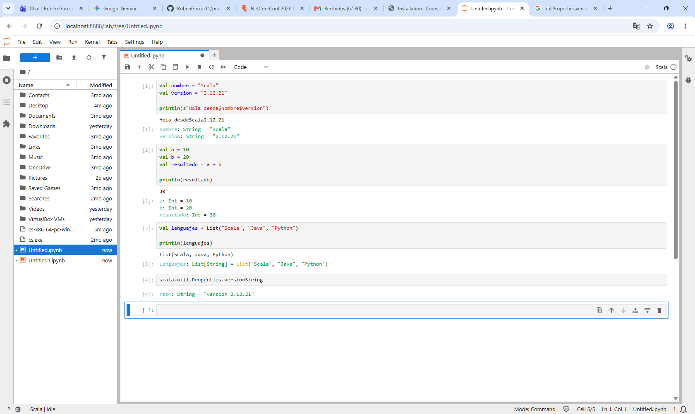

---

## 1.2 Entorno 2 — Visual Studio Code + Metals + Scala 2.12.21 + JDK 17 + sbt

Para proyectos algo más estructurados, he preparado Visual Studio Code. A diferencia del Notebook, aquí trabajamos con archivos compilables y la herramienta de construcción `sbt`.

### Instalación de JDK 17
Antes de configurar el entorno de Scala, era un requisito indispensable contar con una instalación de Java funcional. Para ello, he descargado e instalado el JDK 17 (Java Development Kit) utilizando `winget`.

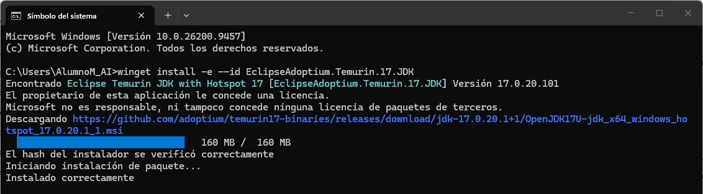

Tras completar la instalación y asegurarme de añadir los binarios al `PATH` del sistema, he abierto una terminal para verificar que tanto el entorno de ejecución como el compilador respondían correctamente, al igual que la versión de `sbt`. Al ejecutar los comandos correspondientes, la consola mostró que todo estaba configurado y listo para usarse, asegurando así la base sobre la que corre Scala:

```bash
$ java -version
openjdk version "17.0.2" 2022-01-18
OpenJDK Runtime Environment (build 17.0.2+8-86)
OpenJDK 64-Bit Server VM (build 17.0.2+8-86, mixed mode, sharing)

$ javac -version
javac 17.0.2
```

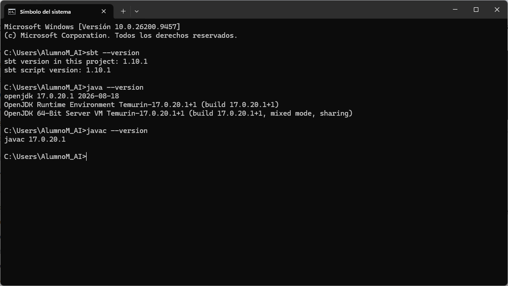

### Visual Studio Code y Metals
Con VS Code ya instalado (y habiendo comprobado su versión correcta), me dirigí al gestor de extensiones.

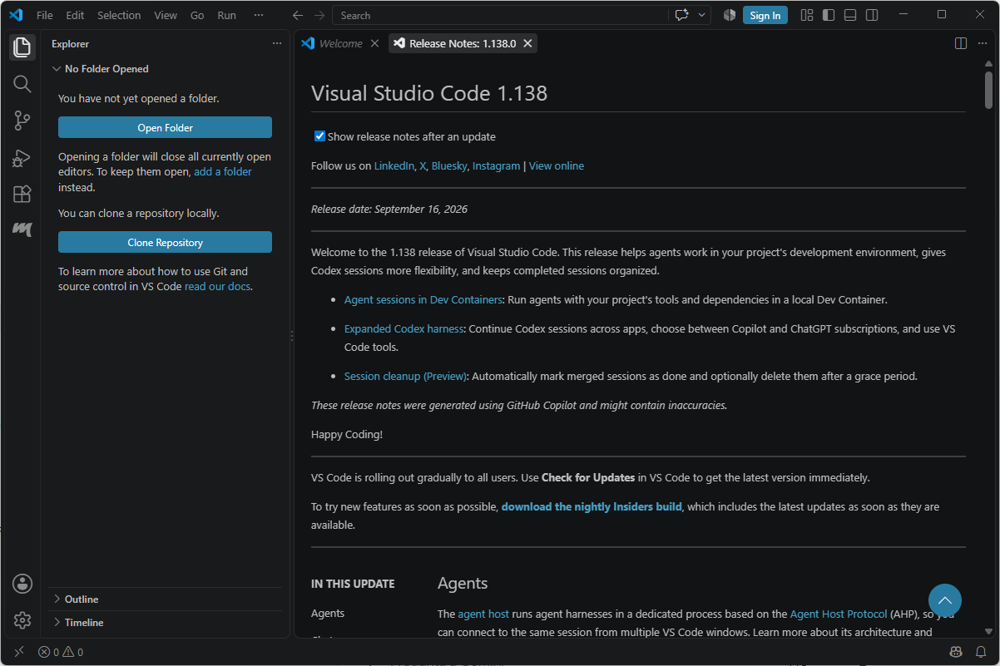

Busqué e instalé "Scala (Metals)". Esta extensión es fundamental para tener autocompletado, detección de errores y facilidades de navegación en proyectos Scala. 

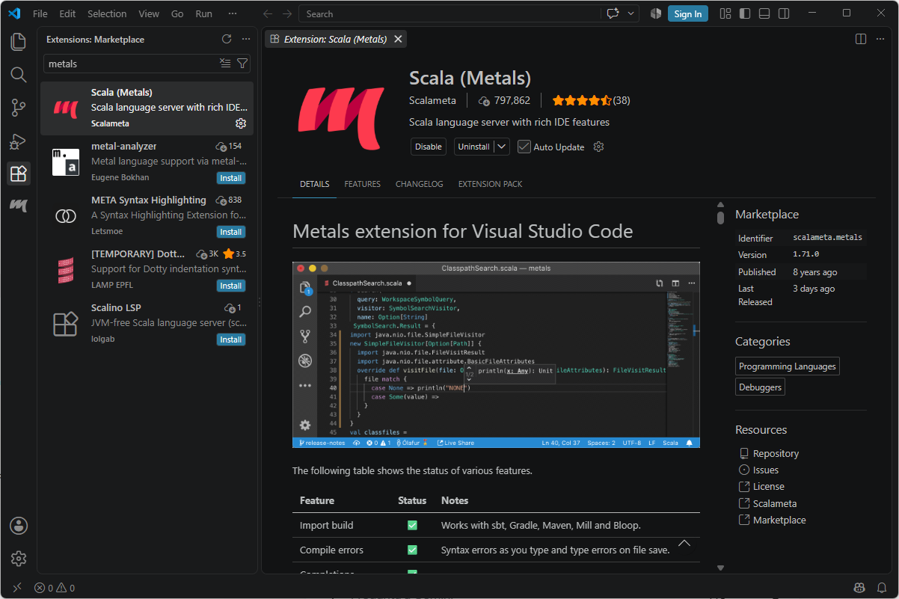

### Configuración del proyecto sbt y Ejecución
Tras comprobar la instalación, creé la estructura de directorios necesaria (`src/main/scala/`) y configuré el archivo `build.sbt` especificando la versión de Scala requerida (`scalaVersion := "2.12.21"`) y el nombre del proyecto (`name := "scala-vscode"`). Al abrir la carpeta en VS Code, Metals detectó automáticamente el proyecto y me pidió importar la configuración. Tras ello, escribí el archivo `Main.scala`. Finalmente, abrí el terminal integrado de VS Code, ejecuté `sbt compile` para compilar el código y luego `sbt run` para ejecutarlo, obteniendo el mensaje por consola esperado.

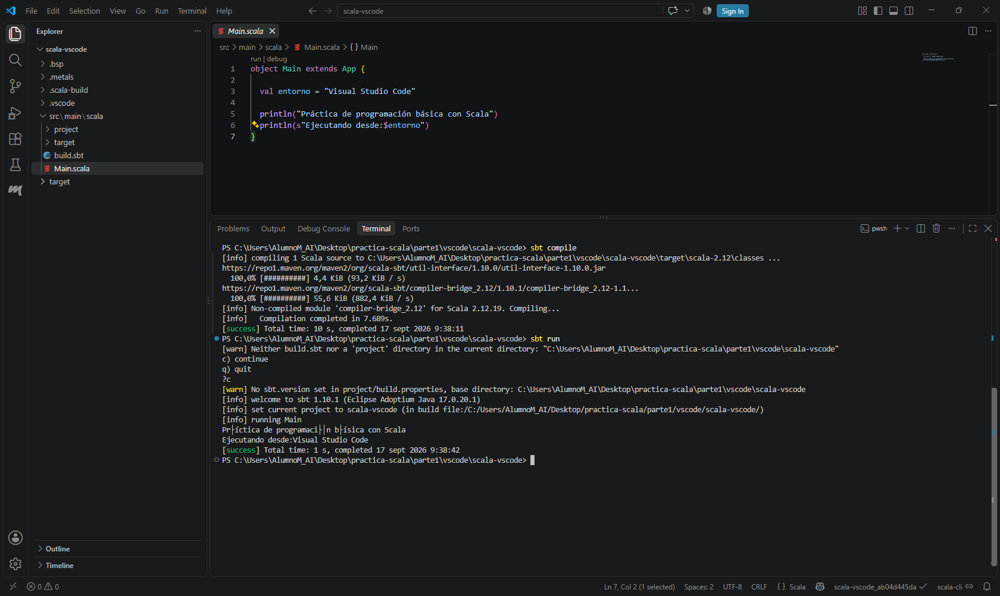

---

## 1.3 Entorno 3 — IntelliJ IDEA Community + Scala 2.12.21 + sbt

Como tercera opción, he configurado IntelliJ IDEA Community Edition, que es uno de los IDEs más potentes y utilizados en el ecosistema Java/Scala, ideal para proyectos complejos con múltiples dependencias.

### Instalación de IntelliJ y Plugin de Scala
La instalación del IDE ha sido directa. Primero, descargué e instalé IntelliJ IDEA Community Edition.


En cuanto abrí IntelliJ por primera vez, fui al apartado de Plugins y busqué e instalé el plugin oficial de Scala. Tuve que reiniciar el entorno para que los cambios surtieran efecto.

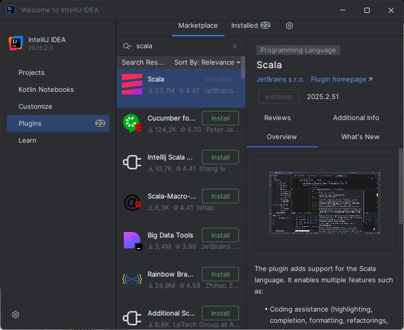

### Configuración del JDK 17 y Proyecto sbt
Al crear el nuevo proyecto basado en `sbt` llamado `scala-intellij`, me aseguré de seleccionar el JDK 17 en la configuración del SDK del proyecto. Esto garantiza compatibilidad y evita problemas al compilar.

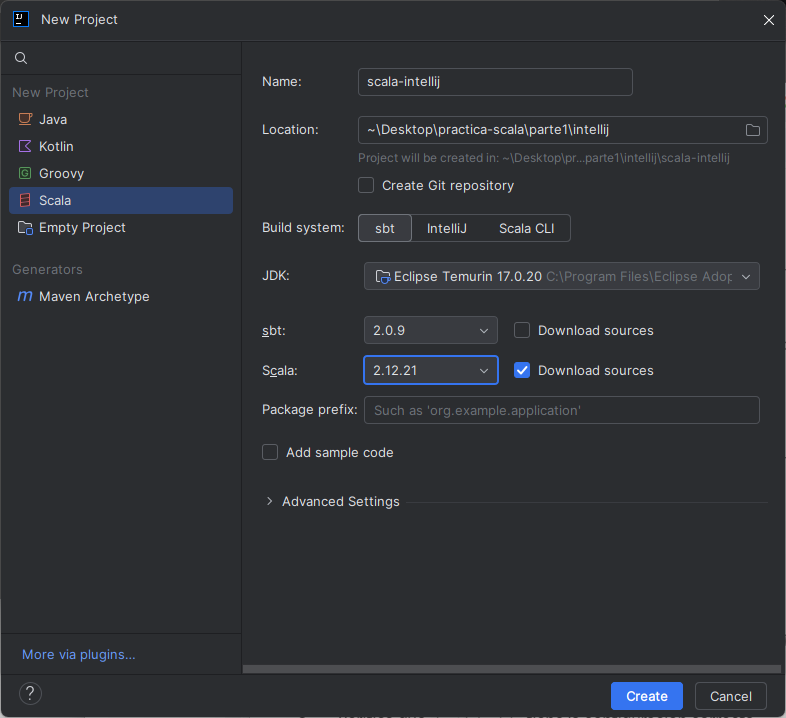

En el archivo `build.sbt` me aseguré de que volviera a apuntar a la versión 2.12.21.

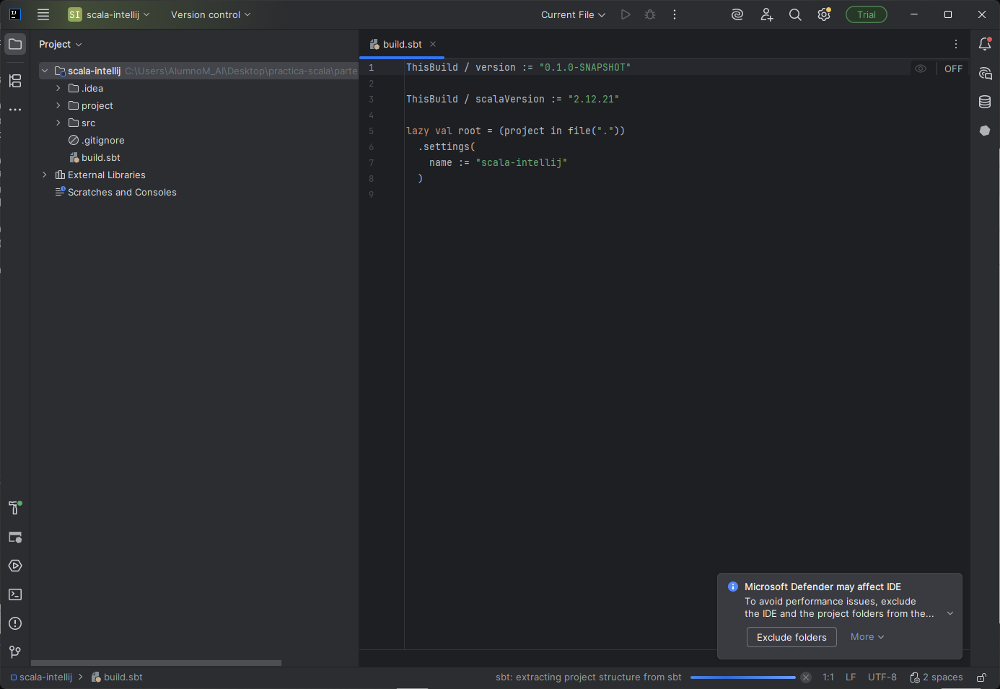

### Ejecución
Creé el archivo `Main.scala` correspondiente, verificando que el código era correcto.

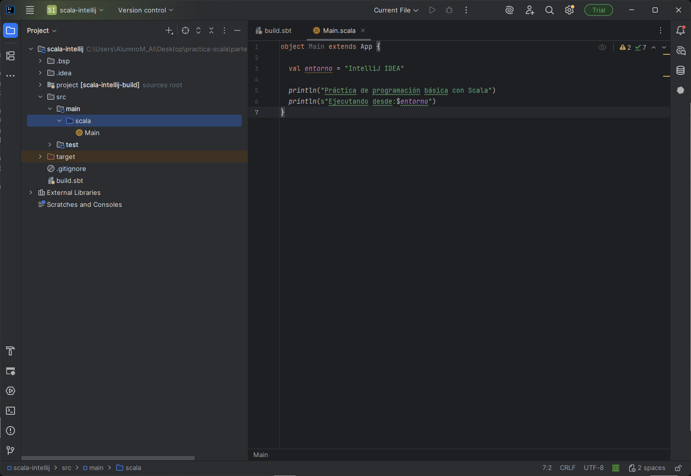

Luego lo probé de dos formas: primero usando el botón de "Play" (Run) integrado del propio IntelliJ, y después utilizando directamente los comandos `sbt compile` y `sbt run` desde la consola. Ambas ejecuciones fueron un éxito.

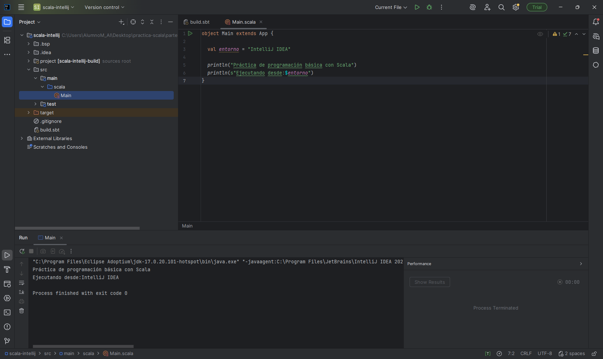
