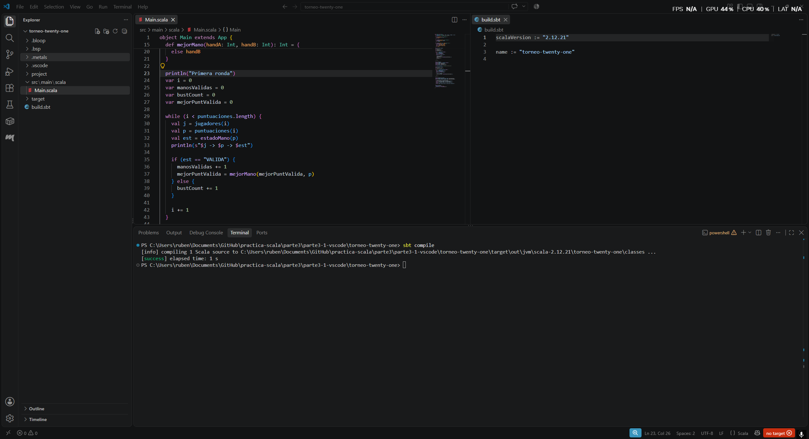
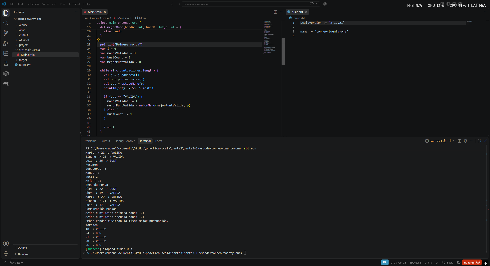

# Mini proyecto 3.1 — Torneo de Twenty-One

## Entorno

- Visual Studio Code
- Metals
- Scala 2.12.21
- JDK 17
- sbt


## Descripción

Este mini proyecto es un clasificador de resultados de un torneo de **Twenty-One**.
El programa analiza las manos (puntuaciones) de diferentes jugadores, determina si sus puntuaciones son válidas o se han pasado de 21 ("Bust") y calcula cuál es la mejor puntuación de cada ronda.

## Estructura

El proyecto está organizado como un proyecto sbt tradicional con la siguiente estructura:
- `build.sbt`: Define la configuración del proyecto (versión de Scala 2.12.21).
- `src/main/scala/Main.scala`: Contiene todo el código fuente y las funciones necesarias para resolver el mini proyecto.
- `images/`: Contiene las capturas de pantalla del funcionamiento del programa.

## Funciones utilizadas

- `bust`: Recibe una puntuación y devuelve `true` si es mayor de 21, y `false` en caso contrario.
- `estadoMano`: Evalúa el estado de la mano de un jugador, devolviendo `"VALIDA"` o `"BUST"`.
- `mejorMano`: Toma dos puntuaciones y decide cuál es la mejor de ambas teniendo en cuenta si alguna se ha pasado de 21.

## Ejecución

Para compilar el proyecto ejecutamos en la terminal de sbt:
```bash
sbt compile
```


Para ejecutar el programa:
```bash
sbt run
```


## Resultados

El programa muestra el estado de cada jugador en ambas rondas, junto a un resumen estadístico (total de jugadores, número de manos válidas, jugadores que se han pasado y la mejor puntuación). Al final, se compara la puntuación máxima obtenida en la primera ronda con la de la segunda ronda para determinar cuál ha sido la mejor.

## Comparación entre `while` y `foreach`

Al utilizar ambas estructuras, hemos observado las siguientes diferencias:

- **Contador:** El bucle `while` necesita un contador (por ejemplo, `var i = 0`), mientras que `foreach` maneja la iteración internamente de cada elemento sin necesidad de un contador manual.
- **Variable mutable:** El bucle `while` exige el uso de una variable mutable (`var i`) para recorrer la colección (para poder incrementar la posición). Por otro lado, `foreach` no precisa variables mutables adicionales.
- **Estilo funcional:** `foreach` se aproxima mucho más al estilo funcional y declarativo, centrándose en *qué* se va a hacer con cada elemento (pasar una función a evaluar), mientras que el bucle `while` pertenece al estilo imperativo, detallando el *cómo* iterar.
