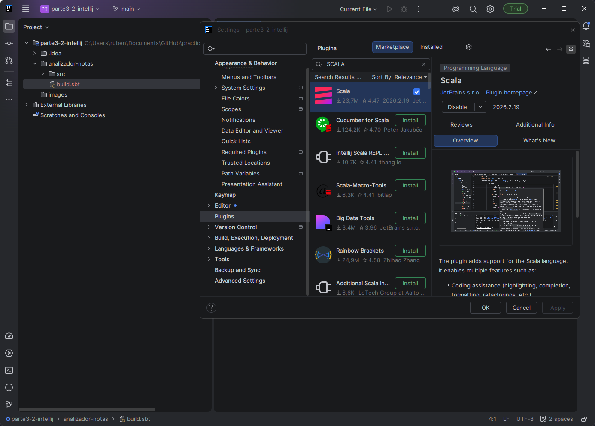
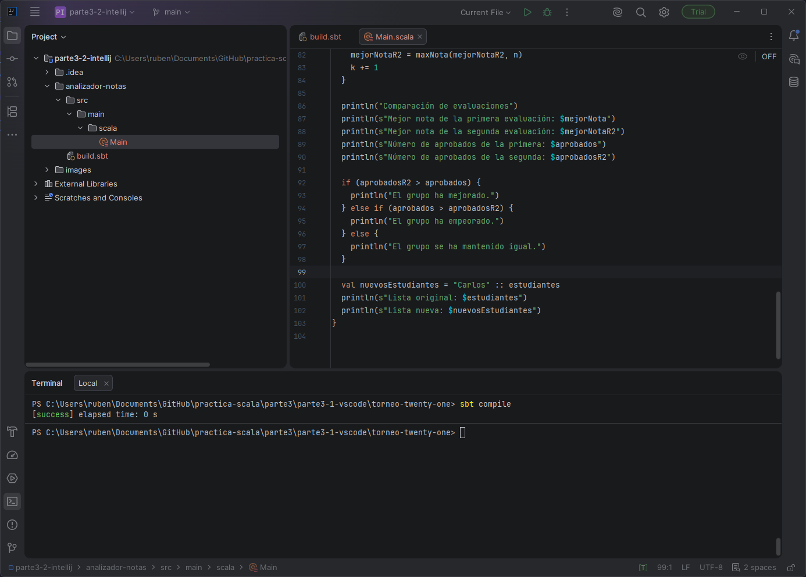
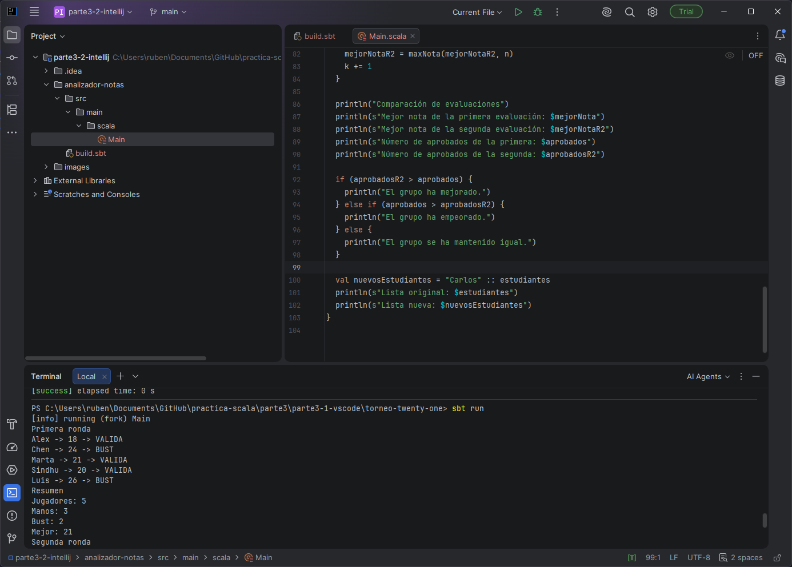

# Mini proyecto 3.2 — Analizador de calificaciones

## Entorno

- IntelliJ IDEA Community
- Scala 2.12.21
- JDK 17
- sbt



## Descripción
Esta aplicación analiza las calificaciones de un grupo de estudiantes utilizando listas y arrays. Determina quién ha aprobado y quién ha suspendido, calcula estadísticas como el número total de aprobados, de suspensos y la máxima nota. Al final, realiza una comparación entre las notas de dos evaluaciones para decidir si el grupo ha mejorado.

## Organización
El código está organizado de manera sencilla en un proyecto de sbt, definiendo el archivo `build.sbt` y empaquetando todo el código principal en `src/main/scala/Main.scala`. Las colecciones iniciales de datos están dentro del objeto `Main`.

## Funciones creadas
- `aprobado(nota: Int): Boolean` : Devuelve verdadero si la nota es >= 5.
- `estadoNota(nota: Int): String` : Devuelve "APROBADO" o "SUSPENSO".
- `maxNota(a: Int, b: Int): Int` : Devuelve el valor máximo entre dos notas numéricas.
- `clasificacion(nota: Int): String` : Utiliza estructuras condicionales para asignar a cada nota una etiqueta (EXCELENTE, NOTABLE, APROBADO o SUSPENSO).

## Colecciones utilizadas
- **`List`**: Utilizada para guardar la lista de nombres de estudiantes (ej. `List("Ana", "Luis", ...)`).
- **`Array`**: Utilizada para almacenar las puntuaciones de las evaluaciones.

## Ejecución

Para compilar el proyecto:
```bash
sbt compile
```


Para ejecutar el proyecto:
```bash
sbt run
```


## Resultados obtenidos
El programa itera sobre las dos evaluaciones, categorizando a cada estudiante y obteniendo resúmenes globales. Al finalizar, el programa determina si hubo mejoras comparando la cantidad total de aprobados entre la primera y la segunda evaluación, mostrando los resultados en la salida estándar de la consola. Adicionalmente, se muestra un ejemplo de inserción en listas en Scala.

## Problemas y soluciones
- *Problema*: Iterar a la vez por los arrays de estudiantes y notas para mostrar los datos de forma combinada.
- *Solución*: Usamos un bucle `while` manteniendo un índice común `i` y accediendo a ambos arrays en la misma posición (por ejemplo, `estudiantes(i)` y `notas(i)`).

## Inmutabilidad de las Listas en Scala

Cuando se utiliza el operador cons (`::`) para añadir un nuevo elemento a la lista original, como en `val nuevosEstudiantes = "Carlos" :: estudiantes`, la lista original (`estudiantes`) no se modifica. Esto se debe a que la clase `List` en Scala es una estructura de datos inmutable.

El operador `::` crea y devuelve una **nueva lista** que contiene el nuevo elemento como cabeza y la lista original como cola. Al ser inmutable, garantizamos la seguridad del código y prevenimos efectos secundarios no deseados al no mutar colecciones en su lugar.
